# MMDVM Dashboard ELK

Центр керування та панель моніторингу в реальному часі для
багаторежимного цифрового голосового хотспота MMDVM (DMR, YSF, NXDN, D-Star)
на базі Raspberry Pi.

Створено для хотспота (ретранслятора) MMDVM на Raspberry Pi 3, але легко
адаптується під будь-яку схожу систему.

> **Безпека понад усе:** типовий пароль адміністратора — `passw0rd`.
> **Змініть його одразу** після встановлення через панель адміністратора.

## Можливості

- **Плитки статусу в реальному часі** — завантаження ЦП, пам'ять,
  температура, час роботи, використання диска
- **Монітор сервісів** — статус онлайн/офлайн усіх сервісів хотспота
  (MMDVMHost, DMRGateway, YSF/NXDN шлюзи, рефлектори, мости, MQTT тощо)
- **Мережевий статус** — показує активну мережу DMR / YSF / NXDN / D-Star, до
  якої підключений хотспот, зчитану наживо з робочої конфігурації
- **Активність шлюзу** — погодинна гістограма передач і таблиця активності у
  стилі "last heard" з позивним, режимом, напрямком, тривалістю та втратами
- **Фільтр за режимом** — перемикачі Всі / YSF / NXDN / DMR / D-Star.
  Фільтрація виконується на сервері по буферу останніх 1000 передач, тому
  рідкісні режими не зникають зі стрічки під час інтенсивного трафіку
  в іншому режимі
- **Прапорці країн** — за DMR ID (MCC) для DMR і за ITU-префіксом позивного
  для YSF / NXDN / D-Star (модуль `itu_flags.py`, повна таблиця розподілу
  префіксів ITU, без зовнішніх залежностей)
- **Графіки за добу** — ЦП, пам'ять, температура з історією на 24 години
- **Журнали сервісів** — перегляд systemd-логів будь-якого сервіса з браузера
- **Панель адміністратора** (захищена паролем):
  - **Редактор конфігів** — редагування `.ini` файлів сервісів із браузера
  - **Статичні TG Brandmeister** — керування статичними групами через BM API
    (див. нижче)
  - **Менеджер оновлень** — перевірка й застосування git-оновлень сервісів з
    автоматичним бекапом і відкатом при збої
  - **Керування сервісами** — запуск / зупинка / перезапуск сервісів
  - Зміна пароля адміністратора
- Оновлення в реальному часі через **MQTT + SSE**
- Адаптивна верстка для мобільних і десктопів
- **Окрема Live-сторінка** (`/live/`) — повноекранний монітор ефіру в реальному
  часі: хто зараз в ефірі, мережевий статус, стрічка останніх подій

## Керування статичними TG (Brandmeister API)

Панель уміє керувати статичними групами вашого хотспота напряму через
**BrandMeister API v2** — без заходу в SelfCare, аналогічно до Pi-Star.

Доступно з панелі адміністратора, кнопка **Статичні TG**:

- перегляд поточних статичних груп
- додавання групи (з вибором таймслота для дуплексних пристроїв)
- видалення групи
- **Обірвати QSO** — розірвати поточну передачу
- **Скинути динамічні** — прибрати всі динамічні групи

**Налаштування:** згенеруйте API-ключ у BrandMeister SelfCare
(*Profile settings → API Keys → + Add Key*) і введіть його у вікні
**Статичні TG**. Ключ зберігається локально у `/opt/dashboard/bm_apikey`
з правами `600` і ніколи не передається нікуди, крім самого BrandMeister.

ID хотспота визначається автоматично з конфігу DMRGateway (секція мережі
з назвою, що містить `Brandmeister`).

> Для **симплексних** хотспотів BrandMeister очікує таймслот `0` — панель
> визначає це автоматично з параметра `Duplex` у `[Info]` конфігу DMRGateway.

## Архітектура

Панель — це односторінковий застосунок на **Flask** (`dashboard.py`), який:
- зчитує метрики системи та логи сервісів наживо
- підписується на **MQTT-брокер** для подій лінків/передач у реальному часі
- віддає самодостатній HTML/JS інтерфейс на порту `85`

Підключення DMR використовує стандартний ланцюг g4klx:

```
MMDVMHost  ->  DMRGateway  ->  DMR-майстер (HBLink / Brandmeister / TGIF / ...)
   :62032        :62031             напр. your-hblink:55555
```

Сучасний MMDVMHost не може залогінитися до DMR-майстра напряму (він шле дані
`DMRP`, а не логін `RPTL`) — тому **DMRGateway** обов'язковий як проміжна
ланка, що виконує рукостискання логіну. Цей репозиторій містить приклад
конфігу DMRGateway і systemd-юніт для нього.

### Кілька DMR-мереж одночасно

DMRGateway дозволяє підключити кілька DMR-мереж і розділити трафік між ними
за номерами TG. Приклад для симплексного хотспота (усе на слоті 2), де
локальні групи йдуть на власний HBLink, а решта — на Brandmeister:

```ini
# Мережа з конкретними TG має йти ПЕРШОЮ
[DMR Network 1]
Enabled=1
Name=HBLink
TGRewrite0=2,11,2,11,1
TGRewrite1=2,22504,2,22504,1

# Мережа з PassAll ловить увесь інший трафік
[DMR Network 2]
Enabled=1
Name=Brandmeister
TGRewrite0=2,9,2,9,1
PCRewrite0=2,94000,2,4000,1001
TypeRewrite0=2,9990,2,9990
SrcRewrite0=2,4000,2,9,1001
PassAllPC1=2
PassAllTG1=2
```

> **Важливо для симплексних хотспотів:** у секції `[Info]` конфігу DMRGateway
> обов'язково має бути `Duplex=0`. Без нього шлюз повідомляє майстру, що
> працює в дуплексі, і BrandMeister відхиляє підключення з помилкою
> *«has wrong configuration»* у Device Logs, хоча логін і пароль правильні.

## Встановлення

Є два способи: автоматичний і ручний (для повного контролю).

### Спосіб 1: автоматичне встановлення (install.sh)

> ⚠️ **Скрипт експериментальний** — протестуйте на чистій системі й зробіть
> бекап перед запуском на робочому Pi.

Найпростіший спосіб. Скрипт `install.sh` інтерактивний: питає ваш позивний,
DMR ID, частоти та дані DMR-майстра, дає вибрати, які компоненти встановити,
і робить решту сам.

Що вміє встановити (на вибір):
- Залежності (git, компілятори, python3-flask, paho-mqtt, mosquitto)
- MMDVMHost (базовий, потребує ручного налаштування модему)
- DMRGateway (з готовим конфігом під ваш майстер)
- YSFGateway + YSFReflector
- NXDNGateway + NXDNReflector
- Дашборд, CLI-скрипти, cron-очищення
- systemd-юніти для всіх сервісів

**Запуск:**

```bash
git clone https://github.com/uw5elk/mmdvm-dashboard-elk.git
cd mmdvm-dashboard-elk
sudo ./install.sh
```

Після встановлення відкрийте `http://<ip-pi>:85`, увійдіть як адміністратор
(пароль `passw0rd`) і **одразу змініть пароль**.

**Важливо:** MMDVMHost і рефлектори все одно потребують доналаштування `.ini`
під ваше залізо (модем, частоти в `[Modem]`, стартові рефлектори). Скрипт
встановлює й компілює компоненти, але не може вгадати параметри вашого
обладнання.

### Спосіб 2: ручне встановлення

Якщо ви хочете ставити покомпонентно та контролювати кожен крок — дивіться
детальну покрокову інструкцію в [docs/INSTALL.md](docs/INSTALL.md).

Стислий варіант (лише дашборд, коли решта стеку вже є):

```bash
# 1. Копіюємо панель
sudo mkdir -p /opt/dashboard
sudo cp dashboard/dashboard.py /opt/dashboard/

# 2. Встановлюємо CLI-помічники
sudo cp scripts/check-updates scripts/update-service /usr/local/bin/
sudo chmod +x /usr/local/bin/check-updates /usr/local/bin/update-service

# 3. Встановлюємо залежності Python
pip3 install flask paho-mqtt --break-system-packages

# 4. Запускаємо (слухає порт 85)
sudo python3 /opt/dashboard/dashboard.py
```

Потім відкрийте `http://<ip-вашого-pi>:85` у браузері.
**Увійдіть як адміністратор і одразу змініть типовий пароль (`passw0rd`).**

### Live-сторінка та міст стану

Live-сторінка (`live/index.html`) кладеться у веб-корінь, наприклад
`/var/www/html/live/`. Щоб вона показувала поточну передачу навіть коли
її відкрили посеред QSO, встановіть міст стану — він тримає останній стан
у retained-топіку MQTT:

```bash
sudo cp dashboard/mmdvm-state-bridge.py /opt/dashboard/
sudo cp systemd/mmdvm-state-bridge.service /etc/systemd/system/
sudo systemctl daemon-reload && sudo systemctl enable --now mmdvm-state-bridge
```

## Вимоги

- Raspberry Pi (перевірено на Pi 3, Debian Trixie)
- Робочий стек хотспота MMDVM (MMDVMHost + шлюзи/рефлектори)
- Python 3 з `flask` і `paho-mqtt`
- MQTT-брокер (напр. `mosquitto`), що публікує події шлюзу
- `DMRGateway` (g4klx) для підключення DMR
- API-ключ BrandMeister — лише для керування статичними TG (необов'язково)

## Структура репозиторію

```
install.sh                      Інтерактивний інсталятор
dashboard/dashboard.py          Панель на Flask (головний застосунок)
dashboard/mmdvm-state-bridge.py Міст стану для Live-сторінки (retained MQTT)
live/index.html                 Повноекранна Live-сторінка ефіру
scripts/check-updates           CLI: перевірка git-оновлень сервісів
scripts/update-service          CLI: оновлення сервісу (бекап + автовідкат)
config-samples/                 Приклади конфігів із заповнювачами
  DMRGateway.ini.sample
  mmdvm-cleanup.cron
systemd/dmrgateway.service      systemd-юніт для DMRGateway
systemd/mmdvm-state-bridge.service  systemd-юніт моста стану
docs/INSTALL.md                 Покрокова інструкція встановлення
docs/screenshots/               Скріншоти дашборду
```

## Скріншоти

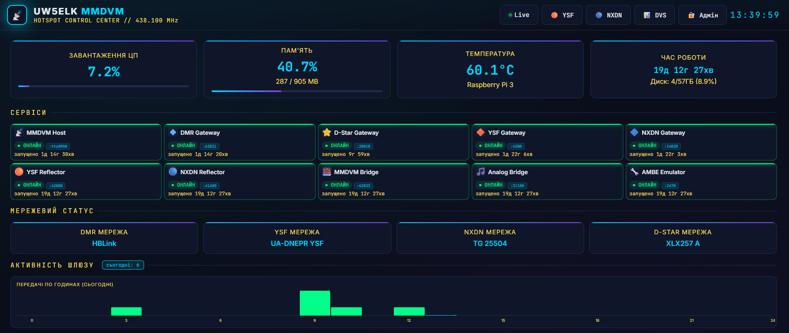

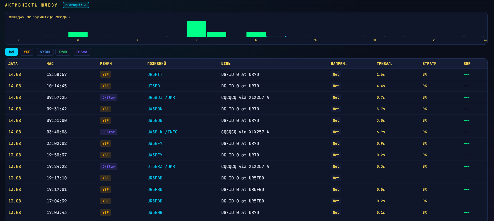

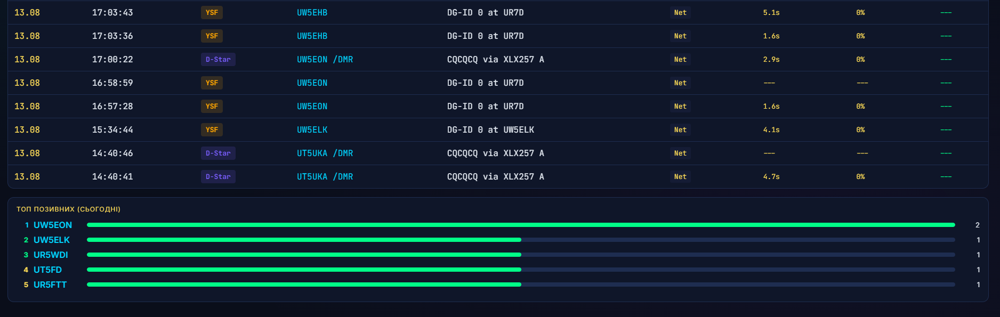

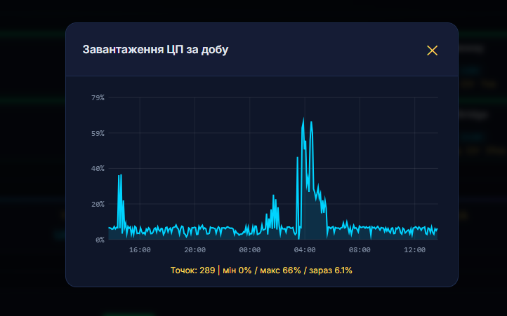

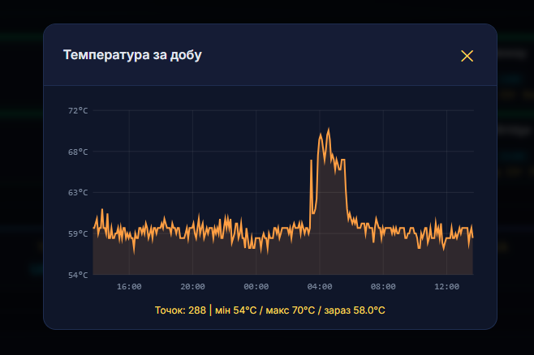

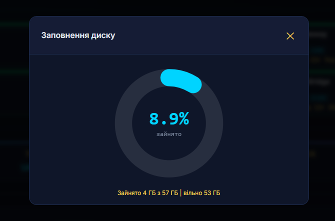

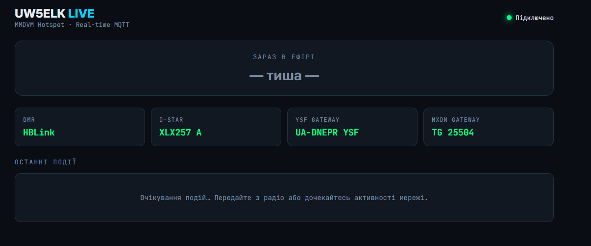

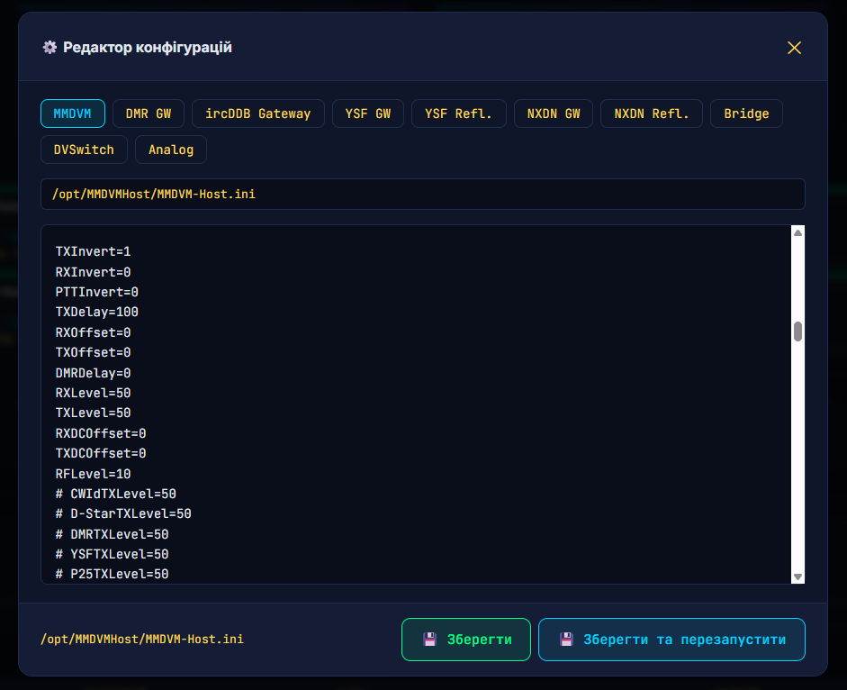

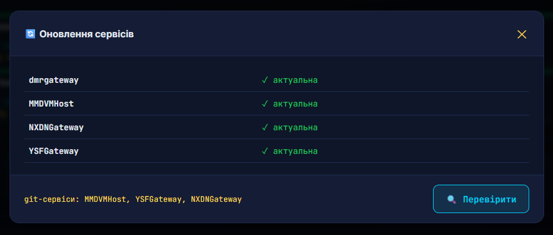

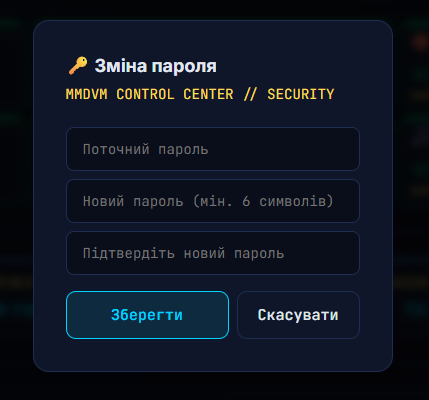

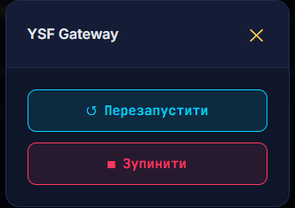

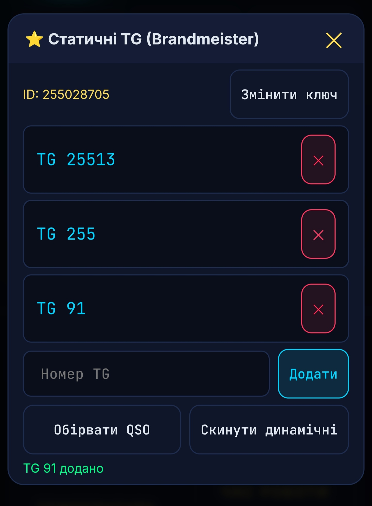

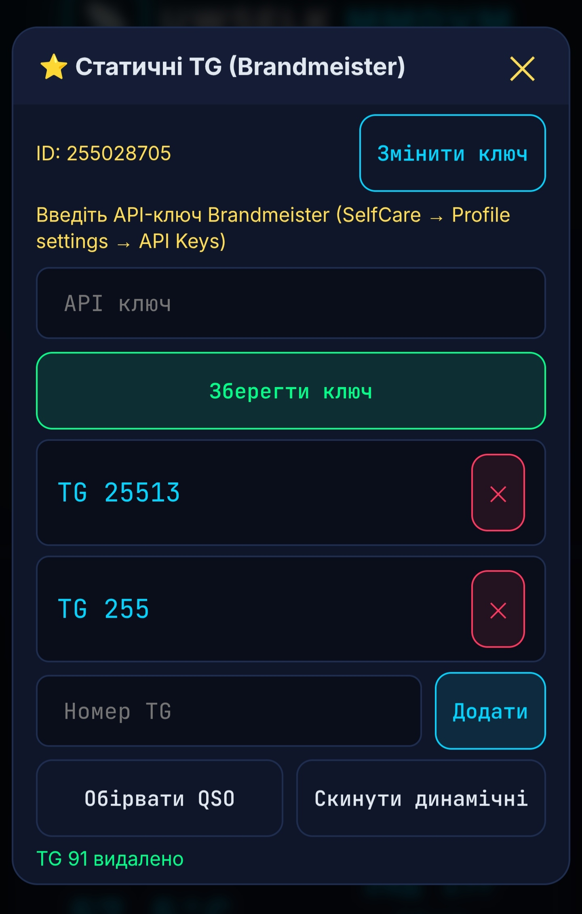

## Подяки

- [g4klx](https://github.com/g4klx) — MMDVMHost, DMRGateway, YSF/NXDN клієнти
- [DVSwitch](https://github.com/DVSwitch) — MMDVM_Bridge / Analog_Bridge
- [BrandMeister](https://brandmeister.network) — API для керування TG
- Панель — UW5ELK

## Ліцензія

MIT — див. [LICENSE](LICENSE).

73!
